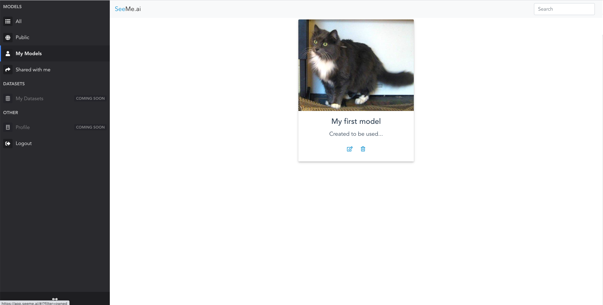
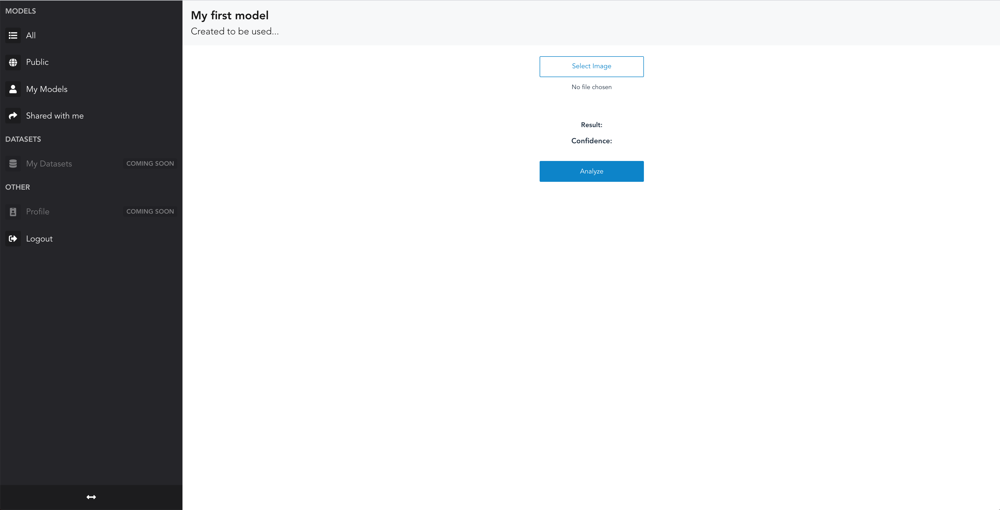
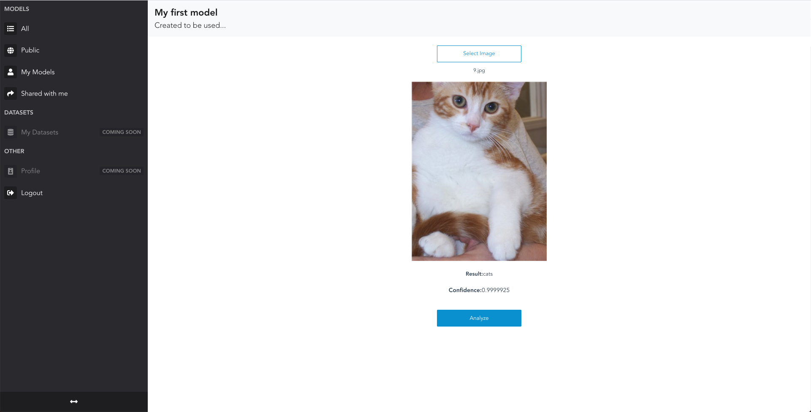
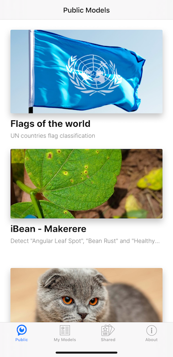
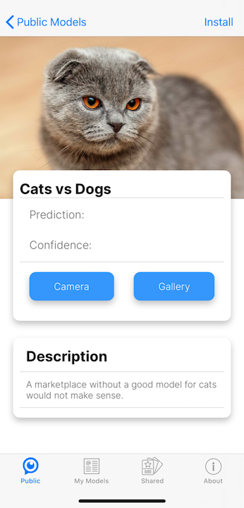
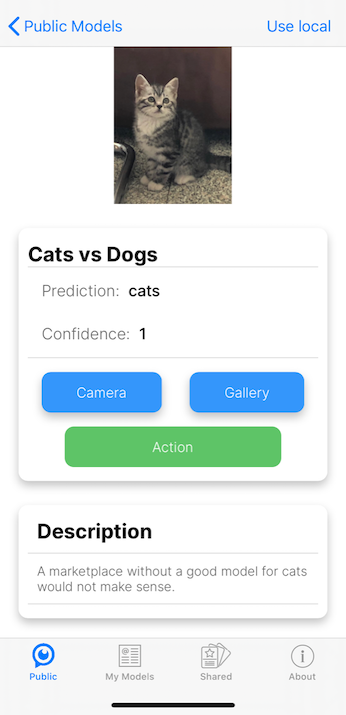
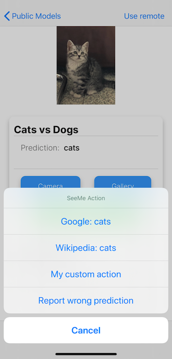
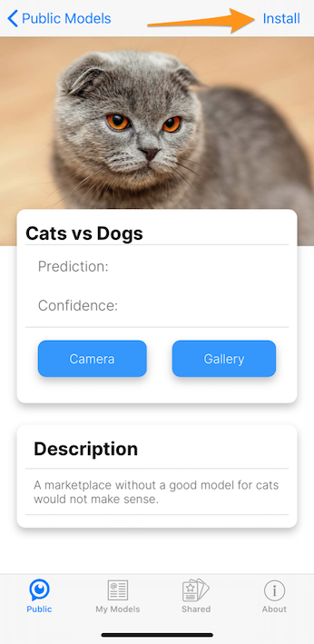
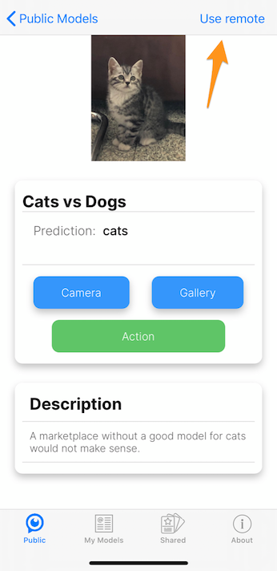
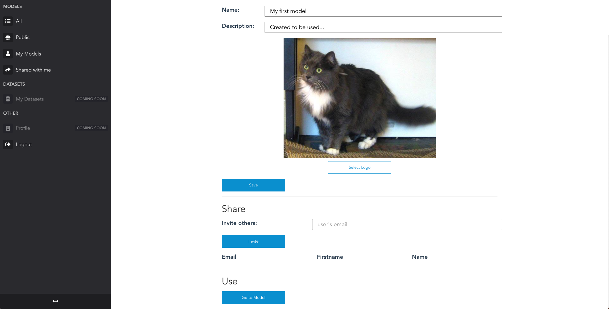

# SeeMe.ai Deployment.

<div class="provider-logo">
  
</div>


This is a quick guide to deploy your trained models in just a few steps using [SeeMe.ai](https://seeme.ai), which allows you to easily deploy, use and share your models.

## Before we begin

If you prefer to have these steps in a Jupyter Notebook, have a look at our [Fast.ai Quick guides on Github](https://github.com/SeeMe-ai/fastai-quick-guides).

## Setup

### Install the SDK

All you need to deploy your model is the Python SDK:

```bash
pip install --upgrade seeme
```

or in your Jupyter Notebook:

```bash
!pip install --upgrade seeme
```

### Create a client

```Python
from seeme import Client

client = Client()
```

### Register an account

If you have not done so already, create an account

```Python
my_password =  # example: "supersecurepassword"
my_username =  # example: "janvdp"
my_email =  # example: "jan.vandepoel@seeme.ai"
my_firstname =  # example: "Jan"
my_name =  # example: "Van de Poel"

client.register(
  username=my_username,
  email=my_email,
  password=my_password,
  firstname=my_firstname,
  name=my_name
)
```

### Log in

```Python
client.login(my_username, my_password)
```

## Deploy your model

### Export your model for deployment

```Python
# Put your model in eval model
learn.model.eval();

# Export your model (by default your model will be exported to `export.pkl`)
learn.export()

## Alternatively, if you want to give the exported file a name

# my_custom_filename = "a_filename_to_remember.pkl"

# learn.export(my_custom_filename)
```

### Create a model on SeeMe.ai

With SeeMe.ai we support different types of AI applications with different frameworks and framework versions.

All you need to do is get the application_id like this:

```Python
import torch
import fastai

# Get the applicationID for your framework (version).
application_id = client.get_application_id(
  base_framework="pytorch",
  framework="fastai",
  base_framework_version=str(torch.__version__), # or pass the version like a string: "1.6.0"
  framework_version=str(fastai2.__version__), # or pass the version like a string: "0.0.26"
  application="image_classification"
)
```

Next, you create your model on SeeMe.ai

```Python
model_name = "My Model name"
description = "Created to be used..."
classes = "Cats and dogs"

my_model = client.create_full_model({
    "name": model_name,
    "description": description,
    "classes": classes,
    "application_id": application_id
})
```

Quick note: to see all the supported applications, platforms and versions:

```Python
from pprint import pprint
pprint(client.applications)
```

### Upload your model

```Python
client.upload_model(my_model["ID"], "folder/to/model")

# Or, if you exported the model with a custom filename
client.upload_model(
  my_model["ID"],
  folder="folder/to/model/",
  filename=my_custom_filename
)
```

### Add a logo (Optional)

```Python
client.upload_logo(
  my_model["ID"],
  folder="folder/to/image",
  filename="image_name.png") # or ".jpg"
```

## Use your model

Once your model is deployed, you can use it in a number of ways:

- [Python SDK](https://pypi.org/project/seeme/)
- [Web app](https://app.seeme.ai)
- [iOS - App Store](https://apps.apple.com/us/app/id1443724639)
- [Android - Play Store](https://play.google.com/store/apps/details?id=ai.seeme)


### Python SDK

You can now use the [Python SDK](https://pypi.org/project/seeme/) to make predictions from basically anywhere, provided you have:

- SeeMe SDK installed
- Login credentials
- The ID of a deployed model
- An image to classiy

```Python
# Here, we will use the Python SDK to classify our test image
image_location = "data/images/image_to_predict.png"

result = client.inference(my_model["ID"], image_location)
```

Print the results

```Python
print(result["prediction"])
print(result["confidence"])
```

### On the web

You can also open the web app via [app.seeme.ai](https://app.seeme.ai) and log in with your credentials.

You will see an overview of all your models as well as the public models that can be used by anyone.

Click on the model to start making predictions.



Here is what the detail screen looks like:



Next:

- click on `select image`
- find an image you would like to classify
- click on analyze
- Look at `result` and `confidence` to see what the prediction is.



### iOS/Android

You can also access all models - yours, shared, and public - on our native mobile apps. You can install them from the [iOS App Store](https://apps.apple.com/us/app/id1443724639) and [Android Play Store](https://play.google.com/store/apps/details?id=ai.seeme).

Once you have logged in, you see the overview of models:



On the model detail, you can take pictures with the camera or select from the gallery:



And see what your model thinks:



Once your model has made a prediction, you will see a green button name "Action". When clicking that button, you have a number of choices:

* search Google for your prediction
* search Wikipedia for your prediction
* Report a wrong prediction



On [iOS](https://apps.apple.com/us/app/id1443724639), we have added automatic conversion to [CoreML](https://developer.apple.com/documentation/coreml) and [ONNX](https://onnx.ai/), when you upload your *.pkl.

This allows you to install and use the model on your device, even when you are offline. 

When the model is available to be installed, you will see the install button on the top right:



Once installed, you can still switch between using the offline or online version of your model:



The screenshots above are all taken on iOS, however, on [Android](https://play.google.com/store/apps/details?id=ai.seeme) all these features work similarly, with one exception for the moment. On Android offline models are still in development.

## Share your model

Once you have tested your model, it is time to share it with friends.

Go back to the home page, and click the `edit` icon.


You will go to the model detail screen:



There you can invite people by entering their email address.

Once invited, they will receive an email to either register (if that email is not yet associated to an account) or to notify them of your model being shared with them.

# Support / Feedback

We would be happy to hear from you or help if something goes wrong or is unclear.

If there is a particular platform you would love to use to make predictions and the above options do not work for you, we would be happy to hear from you. We offer API and local Docker support as well.

Just send a mail to [jan.vandepoel@seeme.ai](mailto:jan.vandepoel@seeme.ai).


